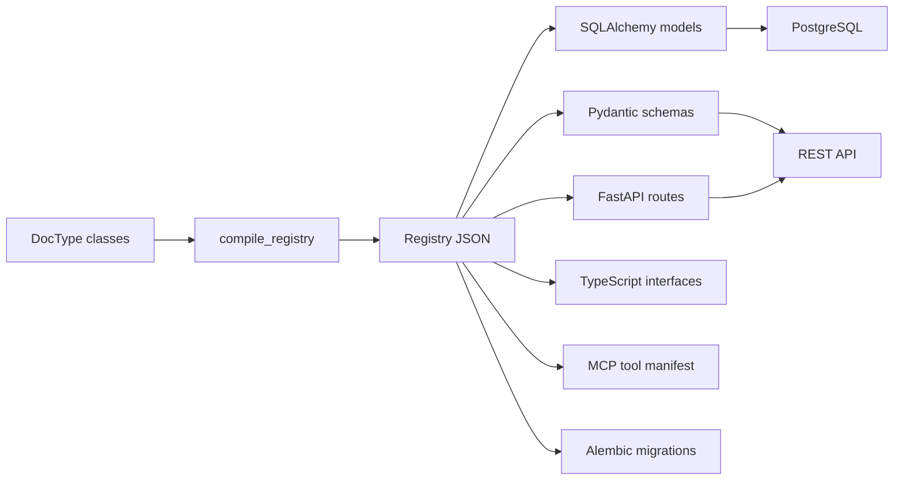

# Architecture

Dhow separates **metadata authoring** from **runtime execution**. You declare DocTypes in Python, compile them into a registry, and the runtime turns that registry into SQLAlchemy models, REST endpoints, and typed schemas.

## Layers

### 1. DocType API (`dhow.core`)

- `doctype.py` — `DocType` base class and `DocTypeMeta` metaclass.
- `field.py` / `types.py` — `Field` definitions and `FieldKind` enum.
- `permissions.py` — declarative `PermissionSet` from class-level `permissions = {...}`.
- `workflow.py` — `StateMachine` and `Approval` workflows.
- `controls.py` — `ImmutableAfter` data controls.
- `registry.py` — `Registry` and `DocTypeEntry` containers.
- `compiler.py` — `compile_registry()` and emitter classes.

### 2. Engines (`dhow.engines`)

All runtime behavior routes through small, replaceable engines:

- `permissions.py` — `PermissionEngine` checks role, field, and row-level grants.
- `execute.py` — `DhowEngine.execute()` is the single chokepoint for every data operation.
- `persistence.py` — builds SQLAlchemy models from registry entries.
- `sequences.py` — per-tenant PostgreSQL sequence helpers.
- `immutability.py` — generates immutable-field triggers.
- `audit.py` — append-only `dhow_audit` table DDL and trigger function SQL.

### 3. Generators (`dhow.generators`)

- `api.py` — generates a FastAPI application from a registry.
- `generated/app.py` — the runtime app module loaded by `dhow serve`.

### 4. CLI (`dhow.cli`)

Typer-based commands that call the layers above:

- `init`, `new module`, `new doctype`
- `build`, `diff`, `migrate`
- `describe`, `schema-search`, `doctor`
- `serve`, `seed`, `test`

## Key design decisions

- **Declarative authoring**: DocTypes are plain Python classes with field descriptors.
- **Single chokepoint**: every create/read/update/submit flows through `engine.execute()`.
- **Permission-first**: operations are denied by default; grants are explicit.
- **Postgres-native**: RLS, sequences, immutable triggers, and audit logs are generated as PostgreSQL DDL.
- **Typed outputs**: Pydantic and TypeScript models are emitted from the same registry.
